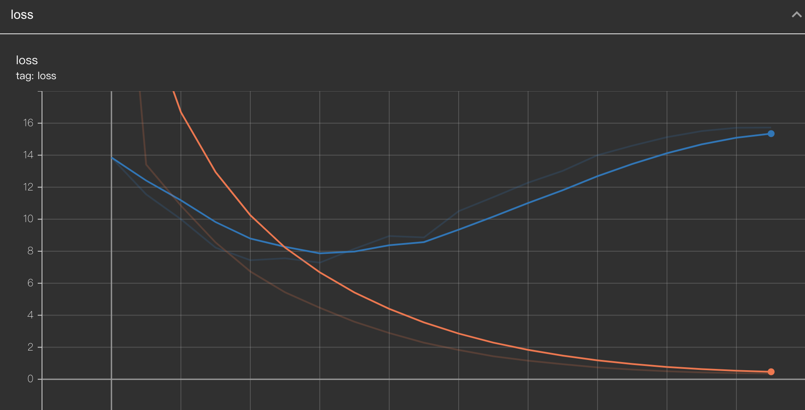
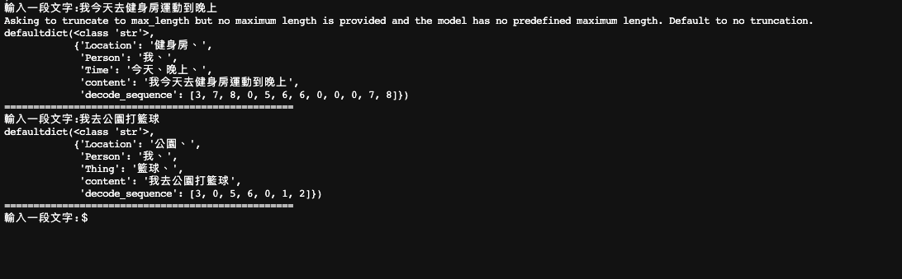

# Named Entity Recognition

# Data
  Using [dataset](https://github.com/lancopku/Chinese-Literature-NER-RE-Dataset) to train NER model, which label is BIO tags

# Model
  Bert + BILSTM + CRF

# Tensorboard

* Loss 
      
* F1 Score
    

# Evaluation Metrics
According to the loss and f1 score on validation dataset, I choose the model of the epoch 3 to evaluate the test dataset and the result is following the down below :
* F1 Score : 0.724
* Precision : 0.73
* Recall : 0.718

# Inference
